# Sparkify Airflow Project

This project builds a reusable Apache Airflow ETL pipeline for Sparkify music streaming data. Raw event and song JSON files are loaded from Amazon S3, staged in Amazon Redshift, transformed into a star schema, and validated with data quality checks.

## Project Goals

- Build a dynamic DAG with reusable custom operators
- Stage JSON data from S3 to Redshift via `COPY`
- Load a fact table and dimension tables using SQL transforms
- Run SQL-based data quality checks after each load
- Support single-run execution without backfill or duplicate concurrent runs

## Repository Structure

```text
Sparkify/
|-- DAGs/
|   `-- project_dag.py                 # Main Airflow DAG
|-- plugins/
|   |-- helpers/
|   |   `-- sql_queries.py             # DDL + SQL transformation statements
|   `-- operators/
|       |-- stage_redshift.py          # Stage from S3 -> Redshift
|       |-- load_fact.py               # Load fact table (append)
|       |-- load_dimension.py          # Load dimensions (truncate-insert)
|       `-- data_quality.py            # Data quality checks
|-- images/                            # DAG graph + Redshift query results
|-- setup_airflow.sh                   # Local Airflow + environment setup
|-- set_aws_conn.sh                    # Airflow connections + variables setup
|-- .gitignore
`-- README.md
```

## DAG Overview

DAG ID: `final_project`

Pipeline graph:


Task flow:

1. `Begin_execution`
2. `Create_tables` — drops and recreates all staging and warehouse tables
3. `Stage_events` and `Stage_songs` (in parallel) — COPY from S3
4. `Load_songplays_fact_table`
5. `Load_artist_dim_table`, `Load_song_dim_table`, `Load_time_dim_table`, `Load_user_dim_table` (in parallel)
6. `Run_data_quality_checks`
7. `Stop_execution`

DAG behavior:

- `depends_on_past=False`
- `retries=1`
- `retry_delay=5 minutes`
- `catchup=False`
- `max_active_runs=1`
- `email_on_retry=False`

## Prerequisites

- Python 3 available in your environment
- Access to an Amazon Redshift cluster
- An S3 bucket containing:
  - Log data under `<s3_log_prefix>` (e.g. `log-data/2018/11`)
  - Song data under `<s3_song_data>` (e.g. `song-data`)
  - A JSON path file (e.g. `log_json_path.json`)
- Airflow connection credentials available as environment variables

Required environment variables for `set_aws_conn.sh`:

| Variable | Description |
|---|---|
| `AWS_ACCESS_KEY_ID` | AWS access key |
| `AWS_SECRET_ACCESS_KEY` | AWS secret key |
| `REDSHIFT_HOST` | Redshift cluster endpoint |
| `REDSHIFT_PORT` | Redshift port (default 5439) |
| `REDSHIFT_DB` | Redshift database name |
| `REDSHIFT_USER` | Redshift username |
| `REDSHIFT_PASSWORD` | Redshift password |

Optional S3 override variables (all have defaults):

| Variable | Default | Description |
|---|---|---|
| `S3_BUCKET` | `jammal-s3` | S3 bucket name |
| `S3_LOG_DATA` | `log-data` | Log data prefix root |
| `S3_LOG_PREFIX` | `log-data/2018/11` | Full log prefix passed to COPY |
| `S3_SONG_DATA` | `song-data` | Song data prefix |
| `S3_LOG_JSON` | `log_json_path.json` | JSON path file key |

## Setup and Run

Run all commands from the repository root.

### 1. Set up Airflow locally

```bash
bash setup_airflow.sh
```

This script:

- Creates a virtual environment at `~/airflow_venv`
- Installs Airflow 2.10.4 and required providers
- Sets `AIRFLOW_HOME` to `/workspaces/Sparkify/airflow_home`
- Links DAGs and copies plugins into Airflow folders
- Initialises the Airflow database and creates an admin user

### 2. Configure Airflow connections and variables

Export your credentials, then run:

```bash
source ~/airflow_venv/bin/activate
bash set_aws_conn.sh
```

This creates:
- `aws_credentials` Airflow connection
- `redshift` Airflow connection
- Airflow variables: `s3_bucket`, `s3_log_data`, `s3_log_prefix`, `s3_song_data`, `s3_log_json`

To use a different S3 bucket or prefix, export the override variables before running the script:

```bash
export S3_BUCKET=my-bucket
export S3_LOG_PREFIX=log-data/2018/11
bash set_aws_conn.sh
```

### 3. Start Airflow services

Terminal 1:

```bash
source ~/airflow_venv/bin/activate
airflow webserver --port 8080 --host 0.0.0.0
```

Terminal 2:

```bash
source ~/airflow_venv/bin/activate
airflow scheduler
```

Open the Airflow UI on port `8080` from the Codespaces PORTS tab.

### 4. Validate DAG loading

```bash
source ~/airflow_venv/bin/activate
airflow dags list
airflow dags list-import-errors
```

### 5. Trigger the pipeline

From UI: enable and trigger `final_project`, or via CLI:

```bash
source ~/airflow_venv/bin/activate
airflow dags trigger final_project
```

## Operators Summary

### `StageToRedshiftOperator`
Truncates the target table then runs a Redshift `COPY` from an S3 path. Supports configurable JSON path, region, and COPY options (`TRUNCATECOLUMNS`, `BLANKSASNULL`, `EMPTYASNULL`, `ACCEPTINVCHARS`).

### `LoadFactOperator`
Appends transformed rows into the fact table using `INSERT INTO ... SELECT`.

### `LoadDimensionOperator`
Loads dimension tables using truncate-insert mode (default) or append mode, controlled by the `truncate_insert` parameter.

### `DataQualityOperator`
Accepts a list of `{check_sql, expected_result}` dicts and raises an error if any result does not match.

## Data Model

Star schema loaded into Redshift:

| Table | Type | Description |
|---|---|---|
| `staging_events` | Staging | Raw log events from S3 |
| `staging_songs` | Staging | Raw song metadata from S3 |
| `songplays` | Fact | Song play events |
| `users` | Dimension | Sparkify users |
| `songs` | Dimension | Song records |
| `artists` | Dimension | Artist records |
| `time` | Dimension | Timestamps broken out by unit |

## Query Results

Row counts and sample data verified in Amazon Redshift after a successful pipeline run.

### Row Counts

| Table | Count |
|---|---|
| staging_events | 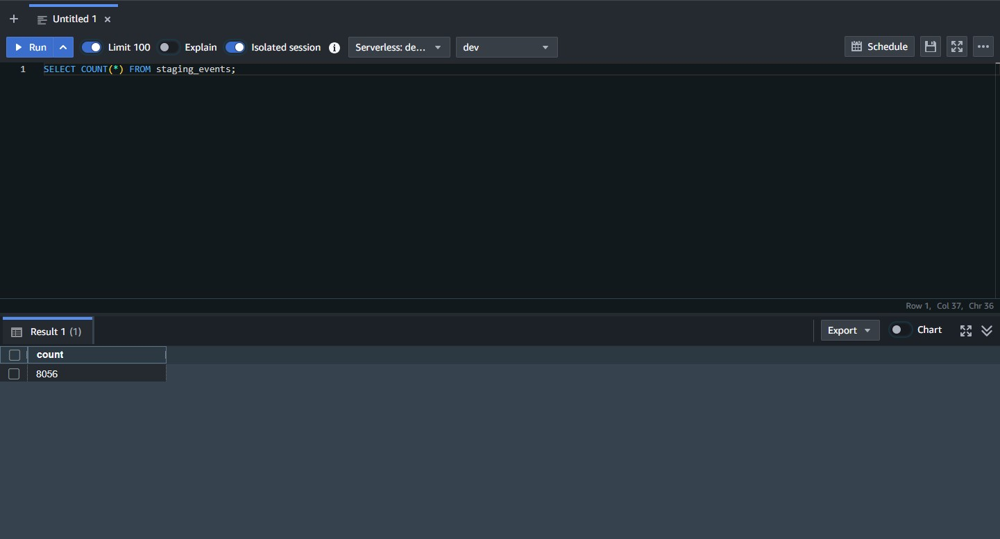 |
| staging_songs | 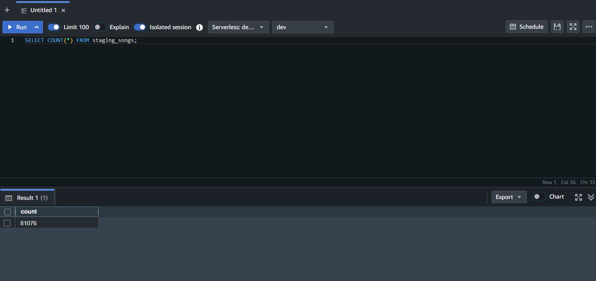 |
| songplays | 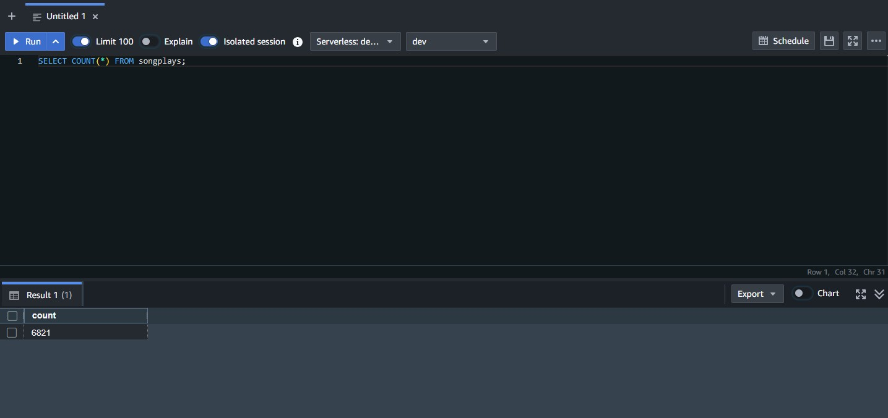 |
| artists | 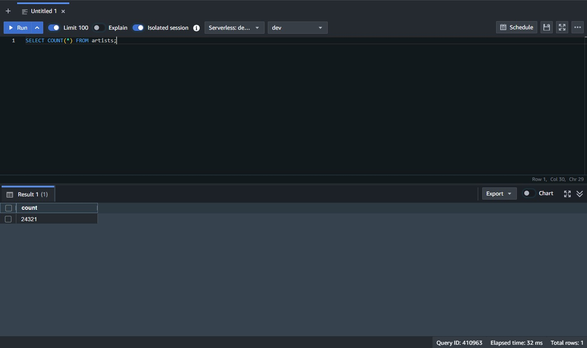 |
| songs | 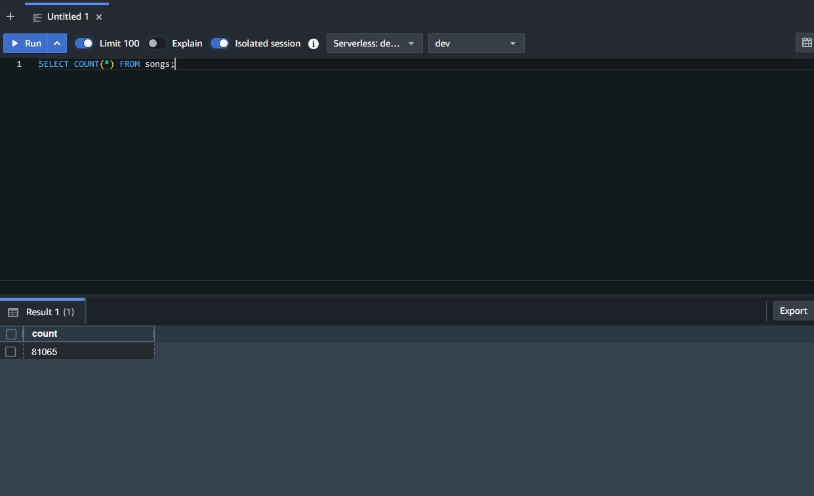 |
| users | 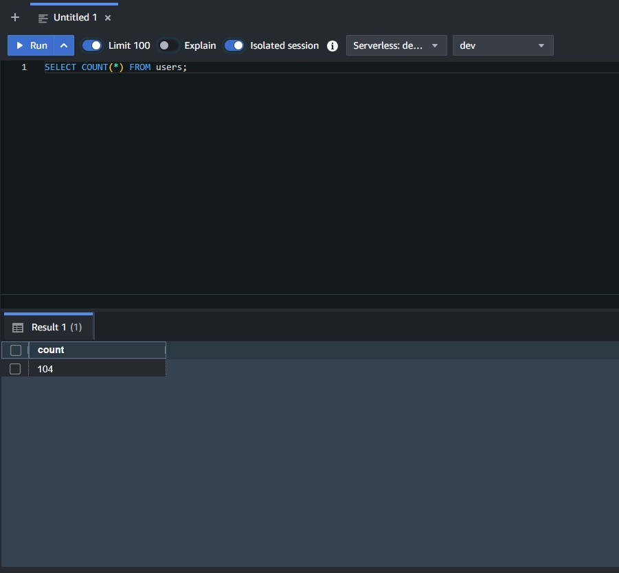 |
| time | 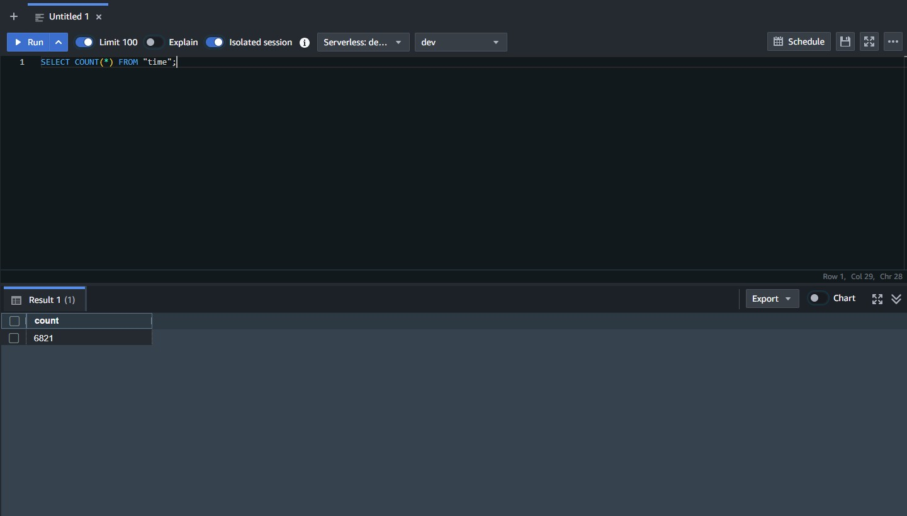 |

### Sample Data

**staging_events**
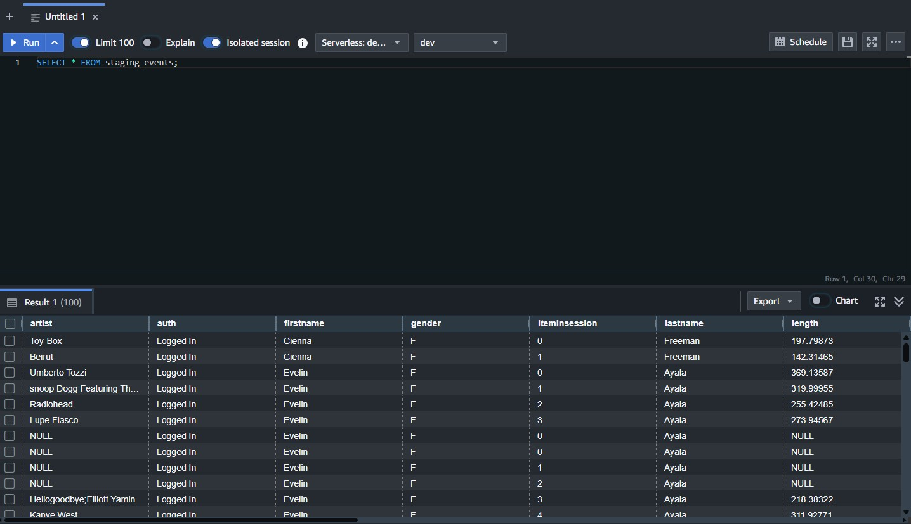

**staging_songs**
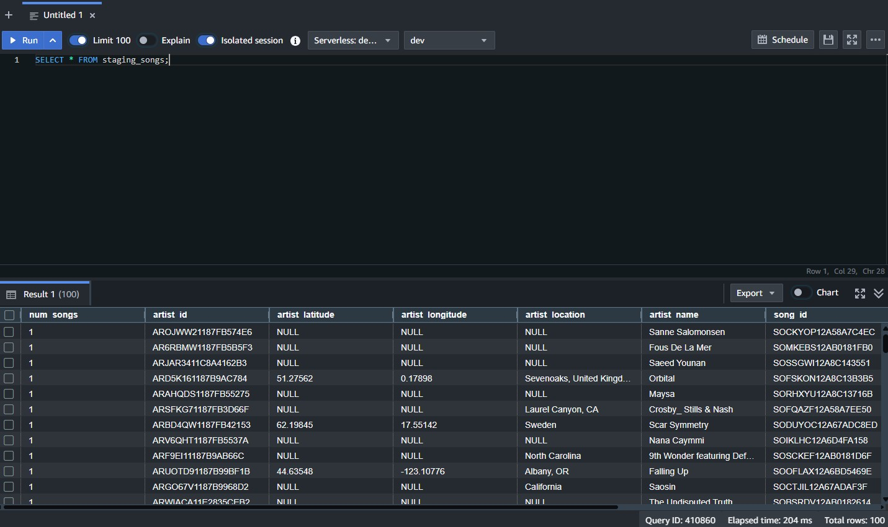

**songplays**
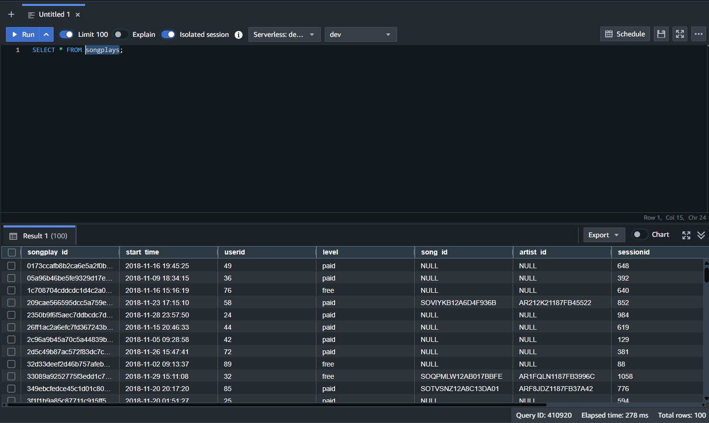

**artists**
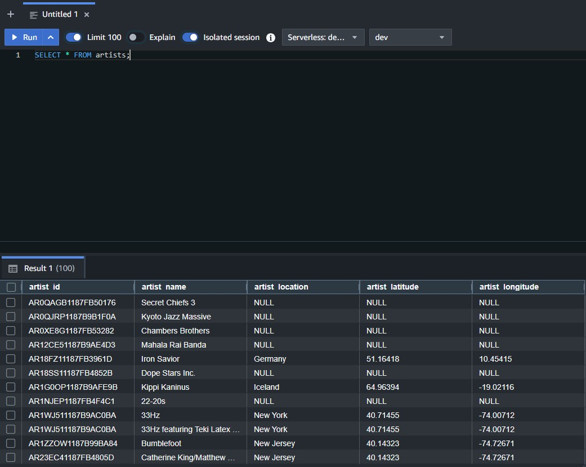

**songs**
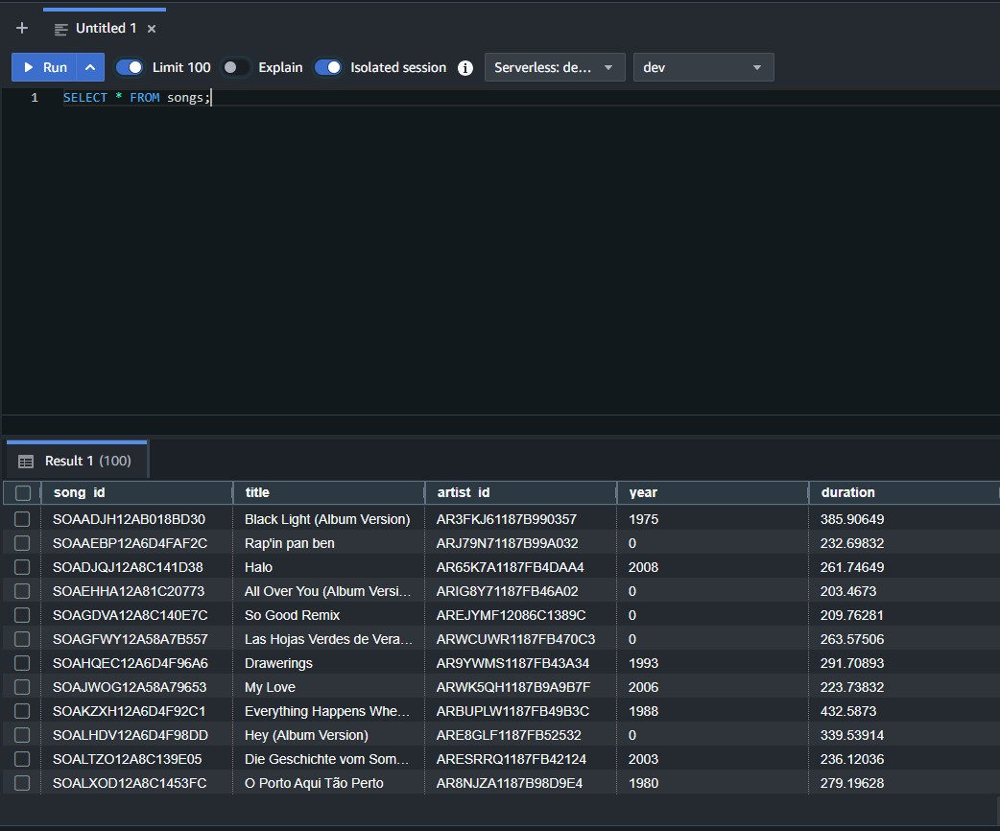

**users**
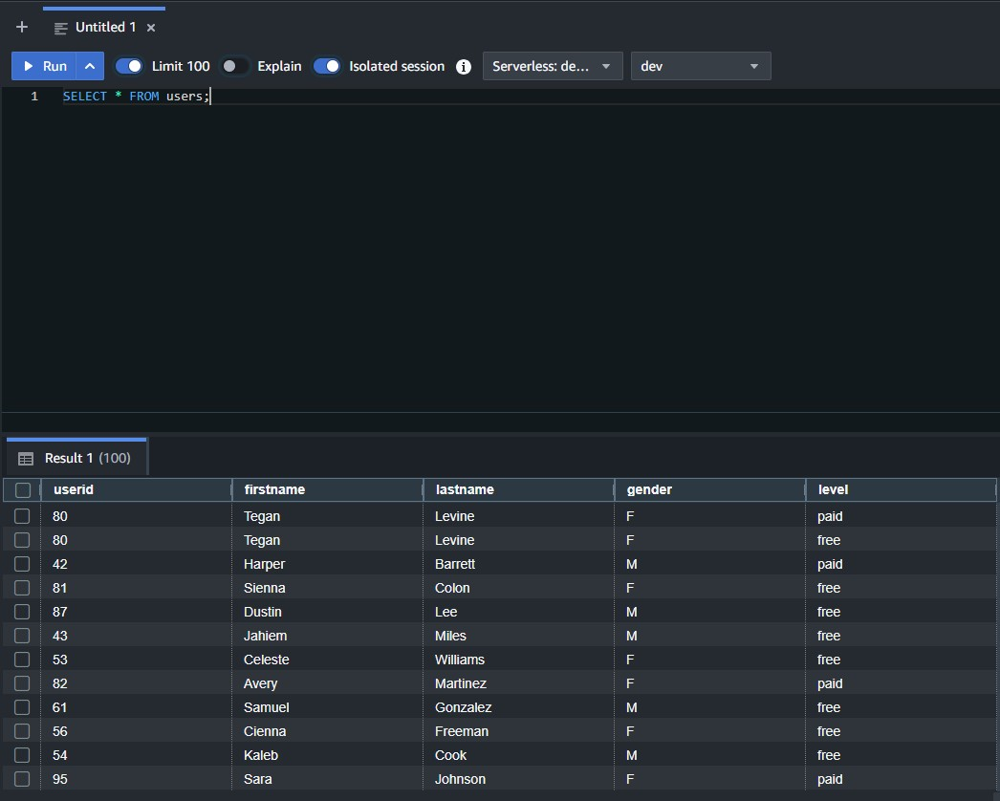

**time**
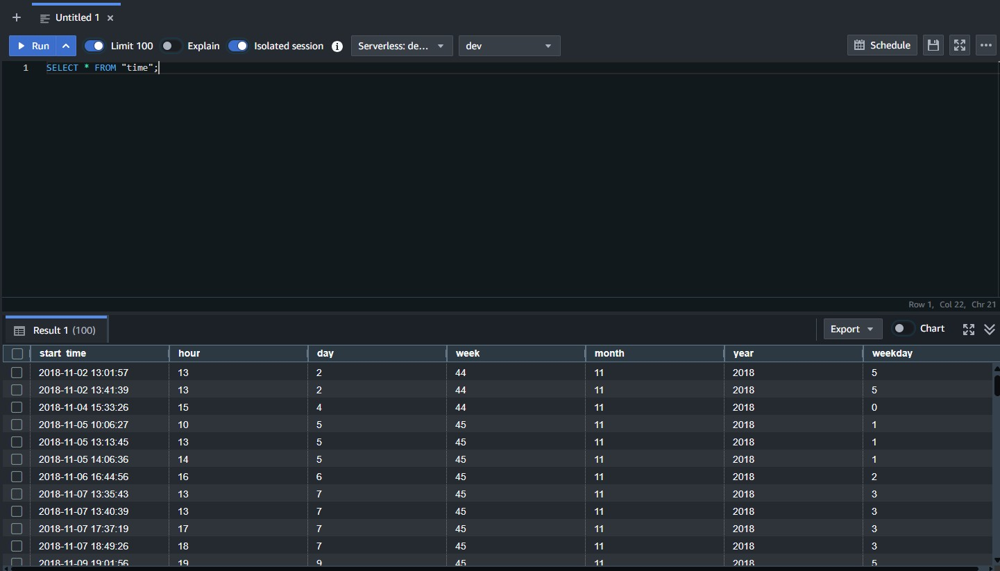

## Notes

- `airflow_home/` is git-ignored to avoid committing Airflow runtime artifacts.
- The `Create_tables` task drops and recreates all tables on every run. This is intentional for this static dataset project.
- If running in a new Codespaces session, re-export your environment variables and run `bash set_aws_conn.sh` again before triggering the DAG.
- If a connection setup command fails, verify all required environment variables are exported in your active shell.